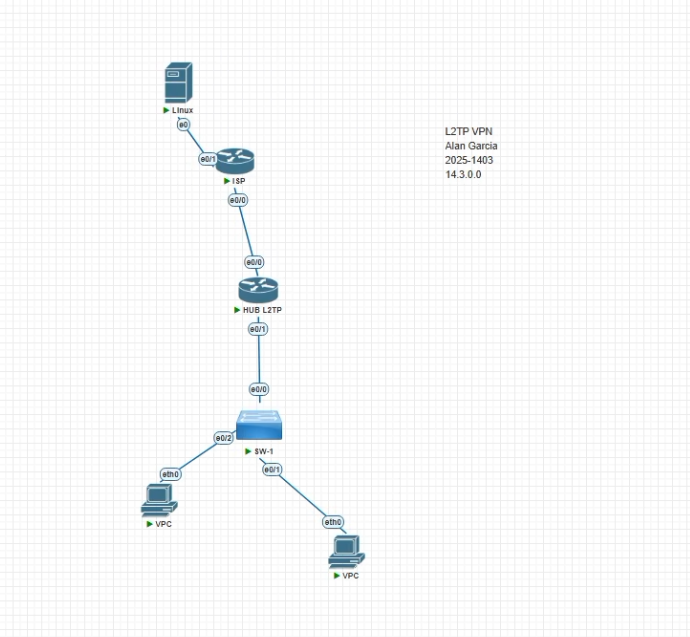
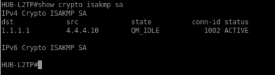
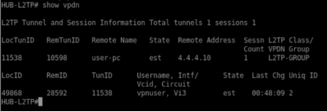
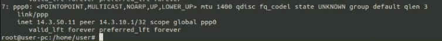
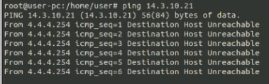
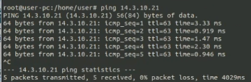
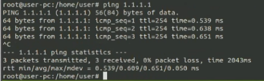
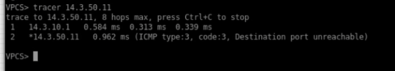

<h1>Instituto Tecnológico de Las Américas (ITLA)</h1>
  
<h2>Configuración y Verificación de VPN Client-to-Site con L2TP/IPSec (IKEv1)</h2>

Documentación Técnica Profesional — Práctica 5 (Semana 6)

   

<strong>Estudiante:</strong> Alan Daniel Garcia Mendez 
<strong>Matrícula:</strong> 2025-1403 
<strong>Carrera:</strong> Seguridad Informática 
<strong>Asignatura:</strong> Seguridad de Redes 
<strong>Docente:</strong> Jonathan Esteban Rondon Corniel 
<strong>Fecha de Entrega:</strong> 2 de julio de 2026 
<strong>Video de Exposición:</strong> <a href="https://youtu.be/rFVnGnA3hfM">https://youtu.be/rFVnGnA3hfM</a>

## Objetivo de la VPN L2TP/IPSec
El objetivo principal de esta configuración es establecer una conexión VPN de tipo Client-to-Site (también denominada de acceso remoto o punto a multipunto) utilizando el protocolo L2TP (Layer 2 Tunneling Protocol) protegido con seguridad IPSec basada en IKEv1. 

Este diseño permite que un cliente remoto, en este caso implementado bajo un sistema operativo Linux, establezca un túnel seguro a través de una red pública no confiable (ISP) hacia la red interna de la organización gestionada por el router HUB. La encapsulación L2TP provee el enlace de datos (Capa 2) para el paso de tráfico de red y la asignación dinámica de direccionamiento IP mediante pools virtuales, mientras que el protocolo IPSec en modo transporte (Transport Mode) asegura la confidencialidad, autenticidad e integridad del túnel cifrando los datos encapsulados sin añadir sobrecarga innecesaria al paquete original.

## Topología de Red y Direccionamiento
La topología implementada en el entorno GNS3 para este laboratorio consta de un router ISP que simula la red pública, un router que actúa como el HUB L2TP que protege la red corporativa, un switch LAN, clientes VPCs internos, y un nodo Linux remoto simulando el teletrabajador o cliente móvil que inicia la negociación VPN.

  
  
Topología detallada del entorno de laboratorio en GNS3

El direccionamiento IP asignado para esta infraestructura se detalla a continuación:

| Dispositivo / Rol | Interfaz | Dirección IP o Pool | Detalles y Configuración |
| :--- | :--- | :--- | :--- |
| **Router ISP (Red Pública)** | Ethernet0/0 | `1.1.1.254/24` | Hacia HUB L2TP |
| | Ethernet0/3 | `4.4.4.254/24` | Hacia Cliente Linux Remoto |
| **Router HUB-L2TP** | Ethernet0/0 | `1.1.1.1/24` | WAN (Puerta de enlace: `1.1.1.254`) |
| | Ethernet0/1 | `14.3.10.1/24` | LAN corporativa |
| | Pool DHCP LAN | `14.3.10.0/24` | Excluye `.1` a `.20` y `.200` a `.220` |
| | Pool VPN L2TP | `14.3.50.10 - .50` | Pool para clientes móviles / remotos |
| **Cliente Linux Remoto** | Red física | `4.4.4.10/24` | Interfaz física conectada al ISP |
| | Virtual (ppp0) | `14.3.50.11` (Dinámica) | Dirección asignada por el Hub L2TP |

## Parámetros de Configuración Utilizados
Para establecer de forma segura el canal de comunicación, se configuraron los siguientes parámetros criptográficos y de red en el HUB:

| Parámetro | Valor Configurado | Descripción |
| :--- | :--- | :--- |
| **Protocolo IKE** | IKEv1 (ISAKMP) | Protocolo de negociación de claves inicial. |
| **Algoritmo de Cifrado** | AES-256 | Cifrado simétrico de alta seguridad para la fase 1. |
| **Función Hash** | SHA-1 | Garantiza la integridad de los paquetes de negociación. |
| **Método de Autenticación** | Pre-share (Clave Compartida) | Clave compartida definida como `L2TPKEY`. |
| **Grupo Diffie-Hellman** | Group 14 (modp2048) | Intercambio de claves seguro de 2048 bits. |
| **IPSec Transform-Set** | `esp-aes 256 esp-sha-hmac` | Parámetros de cifrado del tráfico del túnel. |
| **Modo IPSec** | Transport Mode (`mode transport`) | Cifra solo la carga útil L2TP para optimizar rendimiento. |
| **Protocolo de Autenticación PPP** | MS-CHAP v2 | Protocolo de desafío y respuesta local para el usuario. |
| **Cifrado de Datos PPP** | MPPE Auto | Cifrado de punto a punto de Microsoft para el enlace L2TP. |
| **Credenciales de Usuario** | `vpnuser` / `Cisco123` | Credenciales de base de datos local validadas vía AAA. |

## Explicación y Configuración del HUB
La configuración del HUB L2TP requiere habilitar la funcionalidad de VPDN (Virtual Private Dialup Network) para aceptar las llamadas entrantes bajo el protocolo L2TP y enrutarlas a una plantilla virtual de interfaz (`Virtual-Template1`). La seguridad se gestiona mediante políticas ISAKMP de fase 1 y conjuntos de transformación IPSec de fase 2 aplicados dinámicamente mediante un crypto map.

A continuación, se describen los bloques principales de la configuración aplicados al dispositivo `HUB-L2TP`:

1. **Configuración de Interfaces y DHCP:** Habilitación de la IP pública en la WAN (`1.1.1.1`) y la IP interna de la LAN (`14.3.10.1`), incluyendo el pool de direccionamiento para los clientes locales.
2. **Habilitación de AAA y Autenticación:** Se crea un modelo de autenticación y autorización local (`aaa new-model`) bajo la etiqueta `L2TP-AUTH` y se define el usuario de acceso local `vpnuser`.
3. **Criptografía de Fase 1 (ISAKMP):** Creación de la política 20 de ISAKMP estableciendo cifrado AES de 256 bits, integridad por SHA, intercambio de claves en grupo 14, y autenticación por clave compartida. La clave `L2TPKEY` se configura con dirección global `0.0.0.0 0.0.0.0` para admitir clientes con IPs dinámicas públicas provenientes del exterior.
4. **Criptografía de Fase 2 (IPSec) en Modo Transporte:** Definición de un transform-set llamado `TS-L2TP` con encriptación AES-256 y hashing SHA. Se define obligatoriamente en modo transporte, puesto que la capa de encapsulación L2TP ya se encarga del tunelamiento del paquete IP, por lo que IPSec solo requiere cifrar la carga interna sin duplicar encabezados IP.
5. **Mapeo Dinámico y Crypto Map:** Asociación del transform-set a un mapa criptográfico dinámico (`DYN-L2TP`) y su aplicación en la interfaz WAN Ethernet0/0 para forzar la inspección de paquetes negociados.
6. **Configuración de VPDN y Plantilla Virtual:** Habilitación de VPDN en el sistema global del router y creación del grupo `L2TP-GROUP` que asocia las llamadas entrantes a la interfaz lógica `Virtual-Template1`. Esta interfaz lógica hereda el direccionamiento LAN (`ip unnumbered Ethernet0/1`), establece el pool de asignación remota (`L2TP-POOL`) y requiere autenticación local del usuario a través de `MS-CHAP v2`.

El código completo y estructurado de estos comandos se encuentra respaldado en el archivo de recursos del repositorio: [script_configuracion.txt](resources/script_configuracion.txt).

## Verificación de Conectividad y Funcionamiento

### 1. Estado de la Asociación de Seguridad (ISAKMP SA)
Al iniciar la conexión VPN desde el cliente Linux, se ejecuta una negociación de Fase 1. En el HUB, el comando `show crypto isakmp sa` muestra que se ha establecido con éxito un túnel entre la IP pública del HUB (`1.1.1.1`) y la IP pública del cliente remoto (`4.4.4.10`).

El estado de la SA se encuentra en **`QM_IDLE`** y el estatus reporta **`ACTIVE`**, lo cual indica que la negociación inicial fue correcta, el intercambio de claves Diffie-Hellman Diffie-Hellman Group 14 se completó, y el canal de control está listo y asegurado.

  
  
Asociación de seguridad ISAKMP activa en estado QM_IDLE

### 2. Información del Túnel y la Sesión VPDN
La verificación del protocolo L2TP a nivel de software de acceso telefónico virtual en el HUB se ejecuta mediante el comando `show vpdn`. La salida del dispositivo confirma la existencia de un túnel L2TP establecido (`est`) con el host remoto `user-pc` en la IP `4.4.4.10`. 

Adicionalmente, se reporta una sesión activa asignada a la interfaz de acceso virtual **`Vi3`** (`Virtual-Access3`) para el usuario autenticado **`vpnuser`**, lo que valida que el protocolo AAA completó de forma correcta el login del cliente.

  
  
Estado del túnel L2TP y detalles de sesión VPDN para vpnuser

### 3. Interfaz Virtual PPP en el Cliente Linux
Desde el extremo del cliente remoto Linux, una vez que el servicio de NetworkManager y `xl2tpd` concluyen la autenticación, se crea una interfaz virtual punto a punto denominada **`ppp0`**. El comando de red en Linux muestra que la interfaz tiene la IP local **`14.3.50.11`** asignada por el pool de VPN del HUB, teniendo como extremo remoto (peer) la IP virtual del HUB **`14.3.10.1`**. Esto demuestra el correcto enrutamiento lógico de Capa 3 a nivel virtual.

  
  
Interfaz ppp0 levantada con la IP remota del pool 14.3.50.11

### 4. Prueba de Conectividad sin VPN Activa (Bloqueo del ISP)
Para demostrar la efectividad e importancia del uso del túnel VPN, se realizó una prueba de ping desde el cliente Linux hacia la red interna corporativa (`14.3.10.21`) antes de levantar el enlace cifrado. 

Como era de esperarse, dado que la LAN del HUB utiliza un direccionamiento privado (`14.3.10.0/24`) y los enrutadores intermedios del ISP (`4.4.4.254`) solo enrutan direccionamiento público, el ping falla. El ISP devuelve inmediatamente paquetes de error indicando **`Destination Host Unreachable`**. Esto demuestra que sin el cifrado y encapsulado del túnel, la información corporativa es inaccesible desde el exterior.

  
  
Prueba de conectividad bloqueada por el enrutador del ISP

### 5. Prueba de Conectividad con VPN Activa
Una vez levantado el enlace L2TP/IPSec, se vuelve a ejecutar la prueba de conectividad desde la terminal del cliente Linux hacia el host interno de la LAN corporativa (`14.3.10.21`).

En esta ocasión, los paquetes se encapsulan en L2TP y se cifran a través de IPSec en la interfaz física, saliendo transparentemente por el túnel `ppp0`. El ping se completa con éxito con **0% de pérdida de paquetes** y un promedio rtt mínimo, validando que el cliente remoto tiene total acceso a la subred corporativa protegida.

  
  
Ping exitoso al host corporativo 14.3.10.21 desde el túnel seguro

### 6. Verificación de Enlace Directo al Gateway del Túnel
Adicionalmente, se ejecuta un ping de verificación hacia la IP pública de la WAN del HUB (`1.1.1.1`) a través del enlace de comunicación cifrado. Los pings regresan correctamente con un retardo mínimo (menos de 0.7 ms en promedio) confirmando que el cliente remoto tiene una comunicación robusta y directa con la entrada virtual del router VPN corporativo.

  
  
Ping exitoso a la IP virtual de control 1.1.1.1 desde Linux

### 7. Rastreo de Ruta (Traceroute) desde la LAN al Cliente Remoto
Para culminar las pruebas de verificación, se ejecuta un comando `tracer` desde uno de los hosts VPC locales de la LAN del HUB hacia la dirección VPN asignada al cliente Linux (`14.3.50.11`).

El rastreo de ruta muestra que el primer salto se dirige al gateway local `14.3.10.1` (la interfaz interna Ethernet0/1 del HUB). Posteriormente, el HUB redirige el paquete a través del túnel VPDN L2TP/IPSec directamente al cliente remoto `14.3.50.11` en el segundo salto. La respuesta `Destination port unreachable` obtenida al final del traceroute es el comportamiento estándar de rechazo seguro de un socket cerrado en sistemas operativos tipo Linux que reciben pings UDP traceroute, lo cual confirma que el paquete alcanzó con éxito la tarjeta de red virtual del host remoto.

  
  
Ruta en un solo salto intermedio (HUB) hacia la dirección IP del cliente remoto

